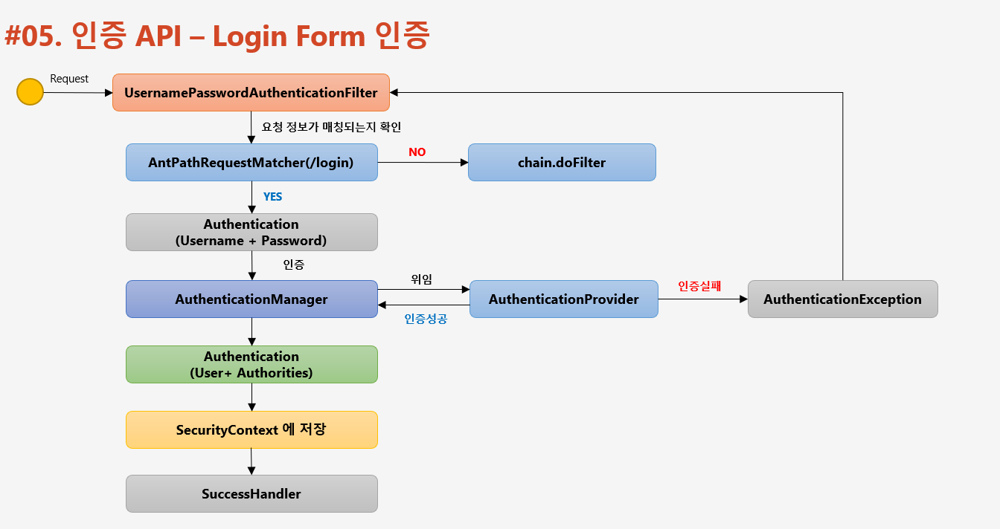
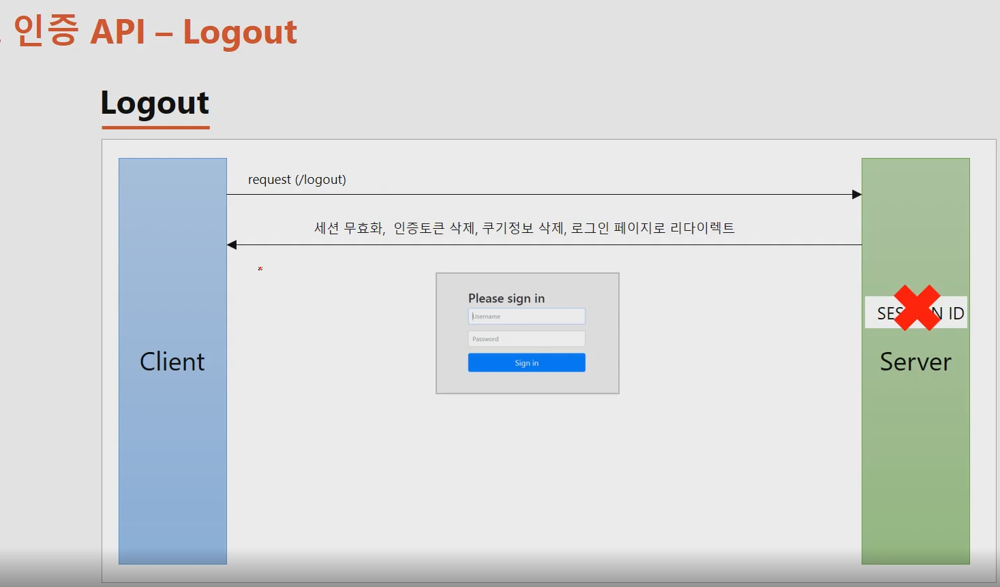
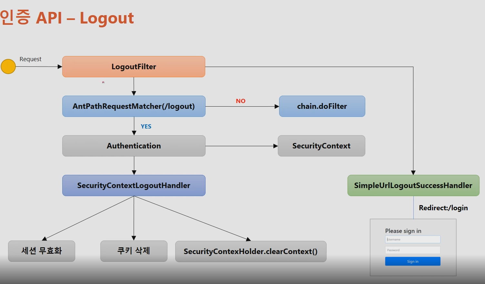

# Spring-security (인프런)

# 스프링 시큐리티 기본 api & Filter의 이해

## UsernamePasswordAuthenticationFilter



사용자가 인증을 요청함.

- UsernamePasswordAuthenticationFilter가 요청정보를 받아서 url을 확인(default : /login)해서 매칭되는지 검사함.
    - 만약 일치하지 않으면 다음 필터로 체이닝하고 일치한다면 실제 인증처리(Authentication)함.
    - 일치한 경우 Authentication 객체를 만들어서 사용자가 요청할때 작성한 username + password 정보를 인증객체에 저장해서 실제 인증객체를 맡기는 역할을 한다.
    - 인증처리를 하기전에 UsernamePasswordAuthenticationFilter가 하는일이고, 인증 객체를 생성 후 인증처리를 맡기는 데 하는 객체가 Authenticationmanager(인증 관리자)가 한다.
    - Authenticationmanager는 내부적으로 AuthenticationProvider라는 객체들을 가지고 있고 인증을 위임하게 된다. (실제로 인증하는 객체)
    - 인증 실패 시 AuthenticationException 발생. 인증성공 시 Authentiacation 객체 만듬.
        - Authentiacation(User + Authorites) 를 반환
    - 반환 받은 Authentiacation객체를 SecurityContext라는 인증객체를 저장하는 저장소에 저장.
    - 나중에는 SecurityContext가 세션에 저장되게 되고 전형적으로 사용자가 SecurityContext안에서 Authentication를 참조할 수 있도록 처리를 해줌.
    - 성공 시 SuccessHandler에서 작업 치리

  FIlterChainProxy (이후 아키텍처 부분에서 더 자세하게 공부) : 로그인을 했을 때, 체이닝된 많은 필터들을 거치게 되는데 이 필터들을 관리하는 빈(객체)이다.

- 스프링 시큐리티를 초기화 했을 때 생성되는 기본적인 필터와 사용자가 WebSecrityConfigurerAdapter를 상속받아서 오버라이딩 했을 때 api에 맞는 필터가 생성되고 커스텀을 추가할 수 있다.
  
## 인증 API - Logout



```java
// http.logout() : 로그아웃 기능이 작동함.

http. logout()                   // 로그아웃 처리
		.logoutUrl("/logout")        // 로그아웃 처리 url
		.logoutSuccessUrl("/login")  // 로그아웃 성공 후 이동페이지
    .deleteCookies("JSESSIONID","remeber-me") // 로그아웃 후 쿠키 삭제
    .addLogoutHandler(logoutHandler()) // 로그아웃 핸들러
    .logoutSuccessHandler(logoutSuccessHandler()) // 로그아웃 성공 후 핸들러
```


## LogoutFilter



사용자가 로그아웃 요청(post)을 하면 LogoutFilter가 받는다.
- antPathRequestMatcher(/logout)이 url이 매칭 되는지 검사 후 일치하지 않으면 다음 필터로 위임
- 일치하면 인증정보를 담고있는 객체인 SecurityContext에서 Authentication(인증) 객체를 받아온다.
- LogoutFilter가 가지고 있는 핸들러중 SecurityContextLogoutHandler 클래스가 세션무효화, 쿠키삭제, SecurityContextHolder.clearContext()로 securityContext 삭제를 합니다.
- 원칙적으로는 로그아웃 시 post여야 하지만 SecurityContextLogoutHandler 을 이용해서 get방식으로 로그아웃 처리가능.
- 이렇게 LogoutFilter의 수행이 정상적으로 종료가 되면 SimpleUrlLogoutSuccessHandler를 호출해서 로그인페이지로 이동하도록 한다.
