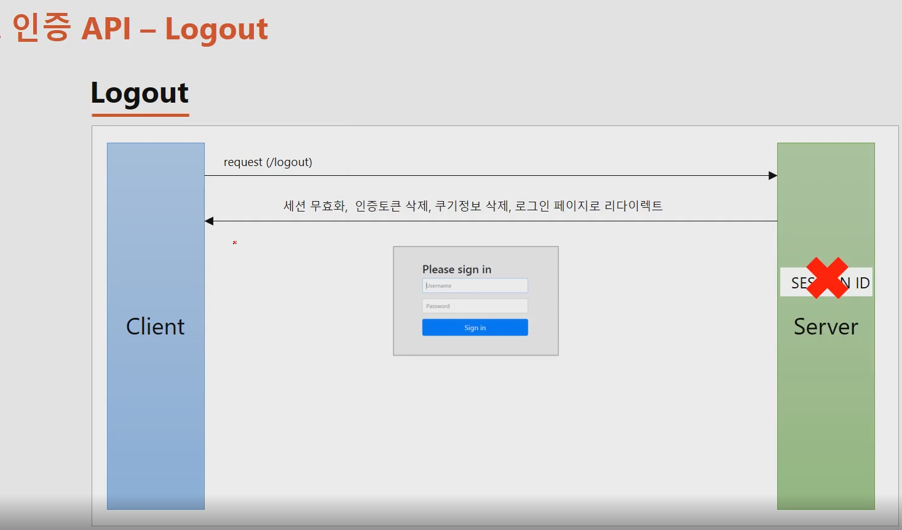
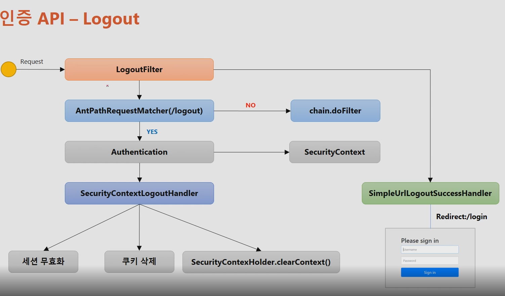
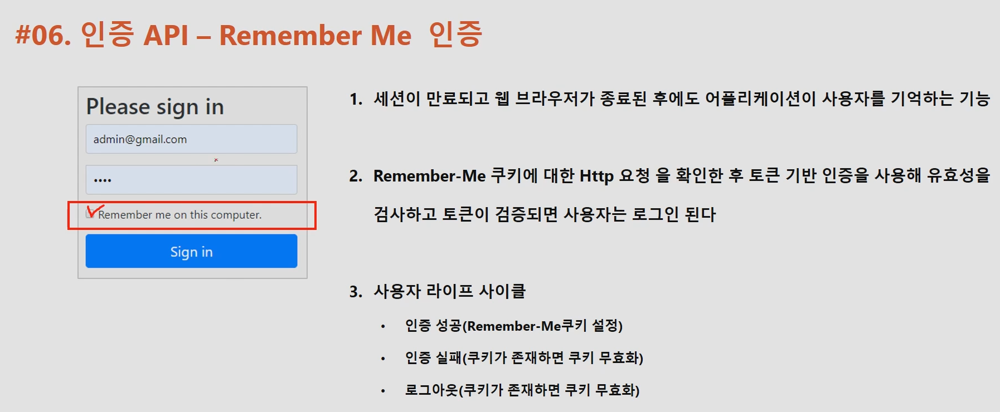
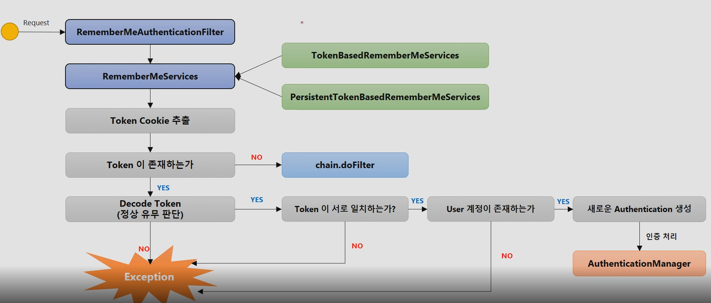
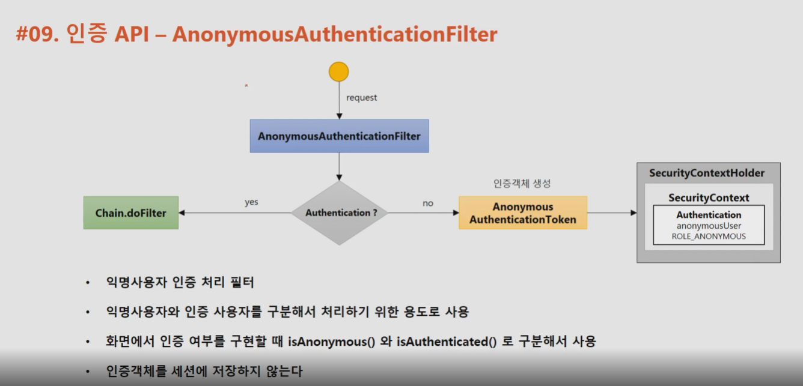
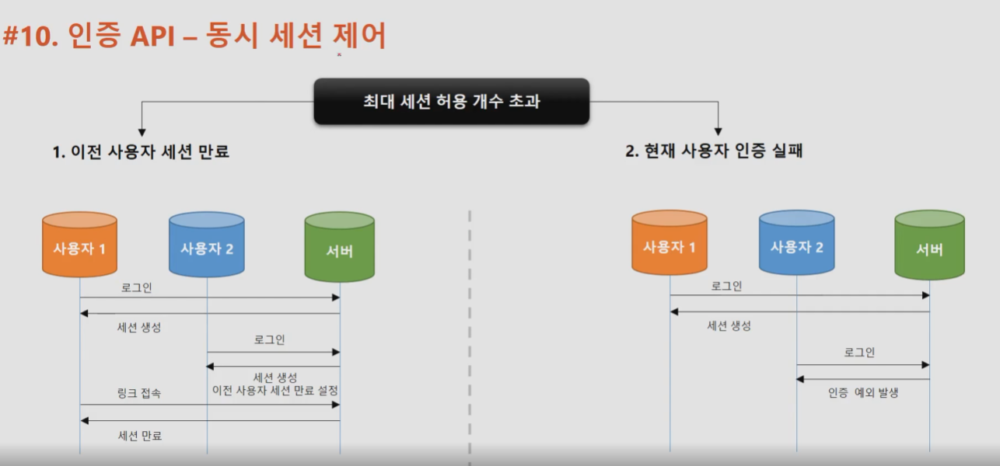
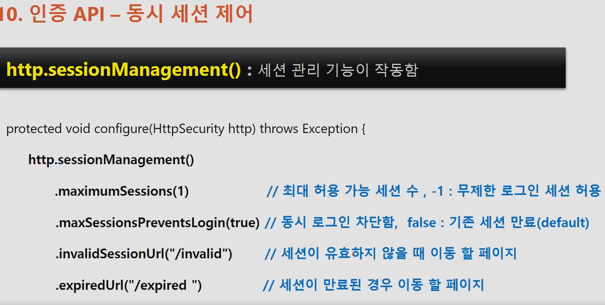

# Spring-security (인프런)

# 스프링 시큐리티 기본 api & Filter의 이해

## UsernamePasswordAuthenticationFilter


사용자가 인증을 요청함.

- UsernamePasswordAuthenticationFilter가 요청정보를 받아서 url을 확인(default : /login)해서 매칭되는지 검사함.
    - 만약 일치하지 않으면 다음 필터로 체이닝하고 일치한다면 실제 인증처리(Authentication)함.
    - 일치한 경우 Authentication 객체를 만들어서 사용자가 요청할때 작성한 username + password 정보를 인증객체에 저장해서 실제 인증객체를 맡기는 역할을 한다.
    - 인증처리를 하기전에 UsernamePasswordAuthenticationFilter가 하는일이고, 인증 객체를 생성 후 인증처리를 맡기는 데 하는 객체가 Authenticationmanager(인증 관리자)가 한다.
    - Authenticationmanager는 내부적으로 AuthenticationProvider라는 객체들을 가지고 있고 인증을 위임하게 된다. (실제로 인증하는 객체)
    - 인증 실패 시 AuthenticationException 발생. 인증성공 시 Authentiacation 객체 만듬.
        - Authentiacation(User + Authorites) 를 반환
    - 반환 받은 Authentiacation객체를 SecurityContext라는 인증객체를 저장하는 저장소에 저장.
    - 나중에는 SecurityContext가 세션에 저장되게 되고 전형적으로 사용자가 SecurityContext안에서 Authentication를 참조할 수 있도록 처리를 해줌.
    - 성공 시 SuccessHandler에서 작업 치리

  FIlterChainProxy (이후 아키텍처 부분에서 더 자세하게 공부) : 로그인을 했을 때, 체이닝된 많은 필터들을 거치게 되는데 이 필터들을 관리하는 빈(객체)이다.

- 스프링 시큐리티를 초기화 했을 때 생성되는 기본적인 필터와 사용자가 WebSecrityConfigurerAdapter를 상속받아서 오버라이딩 했을 때 api에 맞는 필터가 생성되고 커스텀을 추가할 수 있다.
  
## 인증 API - Logout



```java
// http.logout() : 로그아웃 기능이 작동함.

http. logout()                   // 로그아웃 처리
		.logoutUrl("/logout")        // 로그아웃 처리 url
		.logoutSuccessUrl("/login")  // 로그아웃 성공 후 이동페이지
    .deleteCookies("JSESSIONID","remeber-me") // 로그아웃 후 쿠키 삭제
    .addLogoutHandler(logoutHandler()) // 로그아웃 핸들러
    .logoutSuccessHandler(logoutSuccessHandler()) // 로그아웃 성공 후 핸들러
```


## LogoutFilter



사용자가 로그아웃 요청(post)을 하면 LogoutFilter가 받는다.
- antPathRequestMatcher(/logout)이 url이 매칭 되는지 검사 후 일치하지 않으면 다음 필터로 위임
- 일치하면 인증정보를 담고있는 객체인 SecurityContext에서 Authentication(인증) 객체를 받아온다.
- LogoutFilter가 가지고 있는 핸들러중 SecurityContextLogoutHandler 클래스가 세션무효화, 쿠키삭제, SecurityContextHolder.clearContext()로 securityContext 삭제를 합니다.
- 원칙적으로는 로그아웃 시 post여야 하지만 SecurityContextLogoutHandler 을 이용해서 get방식으로 로그아웃 처리가능.
- 이렇게 LogoutFilter의 수행이 정상적으로 종료가 되면 SimpleUrlLogoutSuccessHandler를 호출해서 로그인페이지로 이동하도록 한다.

# 인증 API - Remember Me 인증

1. 세션이 만료되고 브라우저가 종료된 후에도 어플리케이션이 사용자를 기억하는 기능
2. Remember-me 쿠키에 대한 http 요청을 확인 후 토큰 기반 인증을 사용해 유효성을 검사하고 토큰이 검즈오디면 사용자는 로그인된다.
3. 사용자 라이프 사이클
  - 인증 성공 (Remember-Me 쿠키 설정)
  - 인증 실패 (쿠키가 존재하면 쿠키 무효화)
  - 로그아웃(쿠키가 존재하면 쿠키 무효화



## RemembermeAuthenticationFilter



RemembermeAuthenticationFilter는 브라우저가 종료되어서 세션을 사용하지 못하는 경우, 세션 만료가 된 경우 세션을 활성화 되지 않아서 인증객체를 securirt context에서 찾지 못하는 경우 사용자의 인증을 유지하기 위해서 RemembermeAuthenticationFilter가 인증을 시도하고 사용자의 인증을 받게 하여 서버의 인증을 유지해서 접근을 가능하도록 한다.

조건 1. Authentication 객체가 null이 아니어야 함.

조건 2. 사용자가 최초의 form인증을 받을 당시 remember-me 기능을 사용자가 활성화하여 remeberme 쿠키를 서버로부터 발급 받은 경우여야한다.

흐름.

1. 사용자는 세션이 만료된 상태고, 최초 로그인시 remember-me 기능 활성화함.
2. 그러면 RemembermeAuthenticationFilter가 동작함.
3. RememberMeServices는 인터페이스로 TokenBasedRememberMeservices, PersistentTokenBasedRememberMeServices가 구현체이다.
- TokenBasedRememberMeservices - 메모리에서 저장한 토큰과 사용자가 가지고 있는 토큰을 비교하는 방식 (기본적으로 14일 토큰 만료시간을 가짐)
- PersistentTokenBasedRememberMeServices - 토큰을 디비에 저장하고 클라이언트의 토큰과 비교하는 방식
4token cookie 추출(remember-me)
- 없으면 다음 필터 이동
- 있으면 토큰 decode
  - 정상아닐경우 exception
5. 토큰값이 정상일 경우 서버의 토큰과 일치하는지 판단.
- 없으면 exception
6. 토큰에 포함된 정보중 user 계정이 존재하는지 판단.
- 없으면 exception
7. 있으면 새로운 authentication 객체 생성
8. AuthenticationManager에게 인증객체 전달 후 인증처리 완료

# AnonymousAuthenticationFilter



- 일반적으로 익명 사용자는 null로 처리할 수 있는데 AnonymousAuthenticationFilter에서는 null이 아닌 AnonymousAuthenticationToken(익명 사용자 인증 객체)을 만들어서 securityContext안에 저장한다.
- 요청이 일어나고 필터체인의 순서에 의해 앞에 작업이 처리된 후 AnonymousAuthenticationFilter에서 처리할 차례가 오면 Authentication이 있는지 확인 후 있으면(이미 인증된 사용자) 다음 필터로 넘어가고 없으면 AnonymousAuthenticationToken을 만들어서 저장한다.
- 그래서 null값으로 구분하는 것인 아닌 isAnonymous(), isAuthentication() 으로 구분해서 사용한다.
- 인증객체를 생성했더라도 세션에 따로 저장하지 않는다.

AbsctractSecurityInterceptor : 맨 마지막에 인가처리를 하는 보안 필터

- 현재 사용자가 접근하고자 하는 자원에 접근이 가능한지 아닌지 인가 처리를 한다.
- 해당 처리 과정에서 SecurityContextHolder.getContext().getAuthentication() == null 로 검사 후 null 이면 예외를 발생시킨다.
- 그래서 스프링 시큐리티는 Authentication을 곳곳에서 확인하는데 여기서도 확인한다.
- 그래서 익명 사용자도 인증객체를 만들어서 인증된 사용자, 익명 사용자 구분용으로 만든다.


# 동시 세션 제어, 세션 고정 보호, 세션 정책



**동시세션 제어**는 동일한 계정으로 인증을 받을때 생성되는 세션 해당 갯수가 허용 갯수를 초과 되었을 때, 어떻게 세션을 초과하지 않고 유지하는지에 대한 제어를 말함 (2가지)

1. 이전 사용자 세션 만료
  1. 말 그대로 이전 사용자의 세션을 만료시키는 방식
  2. 그림에서 왼쪽으로 만약 세션 허용 갯수가 1개일때, 1번이 먼저 세션을 생성하고, 2번이 이후에 세션을 생성하면 1번 사용자의 세션이 만료된다.
  3. 그래서 다시 1번 사용자가 서버의 자원에 접근할 때 확인 후 세션을 만료시킨다.
2. 현재 사용자 인증 실패
  1. 말 그대로 세션 생성 허용갯수가 초과되면 이후 사용자 로그인에 실패하게 된다.


### 동시세션제어 API 사용법



invalidSessionUrl과 expiredUrl 둘다 사용한 경우 invalidSessionUrl이 더 우선시 되어 적용된다.


### 세션 고정 보호


**세션 고정 공격이란** 공격자가 먼저 서버에 접속해서 session 값을 가진 쿠키를 받고 사용자에게 공격자 쿠리를 사용하도록 합니다.

이후 사용자가 공격자 세션쿠키로 로그인을 시도 후 성공하면 공격자도 같은 세션쿠키를 가지고 있기 때문에 서버에 접근해서 같은 세션을 공유해서 사용자 정보를 탈취할 수 있습니다.

이를 방지하기 위해 스프링 시큐리티에서 사용하는 방법으로 사용자가 공격자가 심어놓은 쿠키로 인증을 하더라도 매번 서버에서 세션과 쿠키를 생성해서 제공한다.

그러면 공격자의 쿠키는 사용자가 인증 성공한 쿠키와 다르므로 공격을 할 수 없게 된다.

## 세션 고정 보호 API


changeSessonId 는 서블릿 3.1 이후에서 기본값으로 사용됨.

migrateSession은 서블리 3.1 이하에서 기본값으로 사용됨.

changeSessonId와 migrateSession는 이전의 세션 속성이나 정보를 이어서 사용가능하지만 newSession은 불가능하다.

none은 공격자에게 무방비 상태가 됨.

# 세션 정책


세션 생성 정책

jwt와 같이 세션을 전혀 사용하지 않을때는 stateless 방식으로 정책을 설정 할 수 있다.
