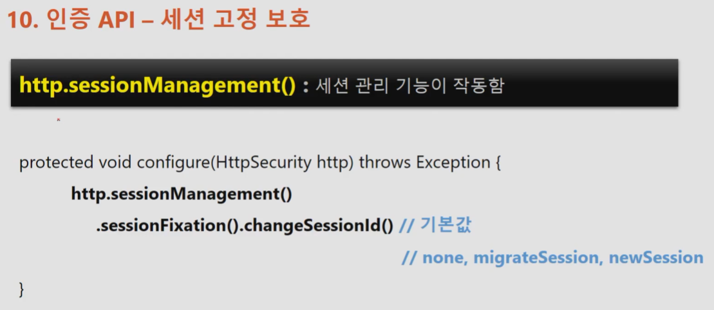

# Spring-security (인프런)

# 스프링 시큐리티 기본 api & Filter의 이해

## UsernamePasswordAuthenticationFilter


사용자가 인증을 요청함.

- UsernamePasswordAuthenticationFilter가 요청정보를 받아서 url을 확인(default : /login)해서 매칭되는지 검사함.
    - 만약 일치하지 않으면 다음 필터로 체이닝하고 일치한다면 실제 인증처리(Authentication)함.
    - 일치한 경우 Authentication 객체를 만들어서 사용자가 요청할때 작성한 username + password 정보를 인증객체에 저장해서 실제 인증객체를 맡기는 역할을 한다.
    - 인증처리를 하기전에 UsernamePasswordAuthenticationFilter가 하는일이고, 인증 객체를 생성 후 인증처리를 맡기는 데 하는 객체가 Authenticationmanager(인증 관리자)가 한다.
    - Authenticationmanager는 내부적으로 AuthenticationProvider라는 객체들을 가지고 있고 인증을 위임하게 된다. (실제로 인증하는 객체)
    - 인증 실패 시 AuthenticationException 발생. 인증성공 시 Authentiacation 객체 만듬.
        - Authentiacation(User + Authorites) 를 반환
    - 반환 받은 Authentiacation객체를 SecurityContext라는 인증객체를 저장하는 저장소에 저장.
    - 나중에는 SecurityContext가 세션에 저장되게 되고 전형적으로 사용자가 SecurityContext안에서 Authentication를 참조할 수 있도록 처리를 해줌.
    - 성공 시 SuccessHandler에서 작업 치리

  FIlterChainProxy (이후 아키텍처 부분에서 더 자세하게 공부) : 로그인을 했을 때, 체이닝된 많은 필터들을 거치게 되는데 이 필터들을 관리하는 빈(객체)이다.

- 스프링 시큐리티를 초기화 했을 때 생성되는 기본적인 필터와 사용자가 WebSecrityConfigurerAdapter를 상속받아서 오버라이딩 했을 때 api에 맞는 필터가 생성되고 커스텀을 추가할 수 있다.
  
## 인증 API - Logout


```
// http.logout() : 로그아웃 기능이 작동함.

http. logout()                   // 로그아웃 처리
		.logoutUrl("/logout")        // 로그아웃 처리 url
		.logoutSuccessUrl("/login")  // 로그아웃 성공 후 이동페이지
    .deleteCookies("JSESSIONID","remeber-me") // 로그아웃 후 쿠키 삭제
    .addLogoutHandler(logoutHandler()) // 로그아웃 핸들러
    .logoutSuccessHandler(logoutSuccessHandler()) // 로그아웃 성공 후 핸들러
```


## LogoutFilter


사용자가 로그아웃 요청(post)을 하면 LogoutFilter가 받는다.
- antPathRequestMatcher(/logout)이 url이 매칭 되는지 검사 후 일치하지 않으면 다음 필터로 위임
- 일치하면 인증정보를 담고있는 객체인 SecurityContext에서 Authentication(인증) 객체를 받아온다.
- LogoutFilter가 가지고 있는 핸들러중 SecurityContextLogoutHandler 클래스가 세션무효화, 쿠키삭제, SecurityContextHolder.clearContext()로 securityContext 삭제를 합니다.
- 원칙적으로는 로그아웃 시 post여야 하지만 SecurityContextLogoutHandler 을 이용해서 get방식으로 로그아웃 처리가능.
- 이렇게 LogoutFilter의 수행이 정상적으로 종료가 되면 SimpleUrlLogoutSuccessHandler를 호출해서 로그인페이지로 이동하도록 한다.

# 인증 API - Remember Me 인증

1. 세션이 만료되고 브라우저가 종료된 후에도 어플리케이션이 사용자를 기억하는 기능
2. Remember-me 쿠키에 대한 http 요청을 확인 후 토큰 기반 인증을 사용해 유효성을 검사하고 토큰이 검즈오디면 사용자는 로그인된다.
3. 사용자 라이프 사이클
  - 인증 성공 (Remember-Me 쿠키 설정)
  - 인증 실패 (쿠키가 존재하면 쿠키 무효화)
  - 로그아웃(쿠키가 존재하면 쿠키 무효화


## RemembermeAuthenticationFilter


RemembermeAuthenticationFilter는 브라우저가 종료되어서 세션을 사용하지 못하는 경우, 세션 만료가 된 경우 세션을 활성화 되지 않아서 인증객체를 securirt context에서 찾지 못하는 경우 사용자의 인증을 유지하기 위해서 RemembermeAuthenticationFilter가 인증을 시도하고 사용자의 인증을 받게 하여 서버의 인증을 유지해서 접근을 가능하도록 한다.

조건 1. Authentication 객체가 null이 아니어야 함.

조건 2. 사용자가 최초의 form인증을 받을 당시 remember-me 기능을 사용자가 활성화하여 remeberme 쿠키를 서버로부터 발급 받은 경우여야한다.

흐름.

1. 사용자는 세션이 만료된 상태고, 최초 로그인시 remember-me 기능 활성화함.
2. 그러면 RemembermeAuthenticationFilter가 동작함.
3. RememberMeServices는 인터페이스로 TokenBasedRememberMeservices, PersistentTokenBasedRememberMeServices가 구현체이다.
- TokenBasedRememberMeservices - 메모리에서 저장한 토큰과 사용자가 가지고 있는 토큰을 비교하는 방식 (기본적으로 14일 토큰 만료시간을 가짐)
- PersistentTokenBasedRememberMeServices - 토큰을 디비에 저장하고 클라이언트의 토큰과 비교하는 방식
4token cookie 추출(remember-me)
- 없으면 다음 필터 이동
- 있으면 토큰 decode
  - 정상아닐경우 exception
5. 토큰값이 정상일 경우 서버의 토큰과 일치하는지 판단.
- 없으면 exception
6. 토큰에 포함된 정보중 user 계정이 존재하는지 판단.
- 없으면 exception
7. 있으면 새로운 authentication 객체 생성
8. AuthenticationManager에게 인증객체 전달 후 인증처리 완료

# AnonymousAuthenticationFilter


- 일반적으로 익명 사용자는 null로 처리할 수 있는데 AnonymousAuthenticationFilter에서는 null이 아닌 AnonymousAuthenticationToken(익명 사용자 인증 객체)을 만들어서 securityContext안에 저장한다.
- 요청이 일어나고 필터체인의 순서에 의해 앞에 작업이 처리된 후 AnonymousAuthenticationFilter에서 처리할 차례가 오면 Authentication이 있는지 확인 후 있으면(이미 인증된 사용자) 다음 필터로 넘어가고 없으면 AnonymousAuthenticationToken을 만들어서 저장한다.
- 그래서 null값으로 구분하는 것인 아닌 isAnonymous(), isAuthentication() 으로 구분해서 사용한다.
- 인증객체를 생성했더라도 세션에 따로 저장하지 않는다.

AbsctractSecurityInterceptor : 맨 마지막에 인가처리를 하는 보안 필터

- 현재 사용자가 접근하고자 하는 자원에 접근이 가능한지 아닌지 인가 처리를 한다.
- 해당 처리 과정에서 SecurityContextHolder.getContext().getAuthentication() == null 로 검사 후 null 이면 예외를 발생시킨다.
- 그래서 스프링 시큐리티는 Authentication을 곳곳에서 확인하는데 여기서도 확인한다.
- 그래서 익명 사용자도 인증객체를 만들어서 인증된 사용자, 익명 사용자 구분용으로 만든다.


# 동시 세션 제어, 세션 고정 보호, 세션 정책


**동시세션 제어**는 동일한 계정으로 인증을 받을때 생성되는 세션 해당 갯수가 허용 갯수를 초과 되었을 때, 어떻게 세션을 초과하지 않고 유지하는지에 대한 제어를 말함 (2가지)

1. 이전 사용자 세션 만료
  1. 말 그대로 이전 사용자의 세션을 만료시키는 방식
  2. 그림에서 왼쪽으로 만약 세션 허용 갯수가 1개일때, 1번이 먼저 세션을 생성하고, 2번이 이후에 세션을 생성하면 1번 사용자의 세션이 만료된다.
  3. 그래서 다시 1번 사용자가 서버의 자원에 접근할 때 확인 후 세션을 만료시킨다.
2. 현재 사용자 인증 실패
  1. 말 그대로 세션 생성 허용갯수가 초과되면 이후 사용자 로그인에 실패하게 된다.


### 동시세션제어 API 사용법


invalidSessionUrl과 expiredUrl 둘다 사용한 경우 invalidSessionUrl이 더 우선시 되어 적용된다.


### 세션 고정 보호


**세션 고정 공격이란** 공격자가 먼저 서버에 접속해서 session 값을 가진 쿠키를 받고 사용자에게 공격자 쿠리를 사용하도록 합니다.

이후 사용자가 공격자 세션쿠키로 로그인을 시도 후 성공하면 공격자도 같은 세션쿠키를 가지고 있기 때문에 서버에 접근해서 같은 세션을 공유해서 사용자 정보를 탈취할 수 있습니다.

이를 방지하기 위해 스프링 시큐리티에서 사용하는 방법으로 사용자가 공격자가 심어놓은 쿠키로 인증을 하더라도 매번 서버에서 세션과 쿠키를 생성해서 제공한다.

그러면 공격자의 쿠키는 사용자가 인증 성공한 쿠키와 다르므로 공격을 할 수 없게 된다.

## 세션 고정 보호 API



changeSessonId 는 서블릿 3.1 이후에서 기본값으로 사용됨.

migrateSession은 서블리 3.1 이하에서 기본값으로 사용됨.

changeSessonId와 migrateSession는 이전의 세션 속성이나 정보를 이어서 사용가능하지만 newSession은 불가능하다.

none은 공격자에게 무방비 상태가 됨.

# 세션 정책


세션 생성 정책

jwt와 같이 세션을 전혀 사용하지 않을때는 stateless 방식으로 정책을 설정 할 수 있다.

# 세션 제어 필터 : SessionManagementFilter, ConcurrentSessionFilter


# 세션 제어 필터 : SessionManagementFilter, ConcurrentSessionFilter


ConcurrentSessionFilter는 SessionManagementFilter와 연계하여 동시적 세션 제어를 한다.


매 요청 마다 session.isExpired == true로 세션 만료 여부 체크한다.


1. 사용자가 이미 세션을 가지고 있는 계정으로 인증했는데 최대 세션 허용갯수가 초과된 경우 세션 제어 정책에 따라 제어를 하게되는데(sessionManagementFilter) 여기서는 이전 사용자 세션만료 정책에 대한 그림임.
2. 새로운 사용자가 인증을 하면 session.expireNow()로 이전 사용자의 세션이 만료가 되고 이전 사용자가 만약 다시 한번 요청을 보내서 서버에 접근을 한다면 세션이 만료되었는지 확인(ConcurrentSessionFilter) (session.isExpired) 후 오류 페이지를 응답하고 이전 사용자가 가지고 있는 세션 만료시킨다.


**인증부터 각각의 필터의 전반적인 처리과정 ( 최대 세션 허용갯수 1개 가정)**


사용자1이 로그인 시도.

- usernamePasswordAuthenticationFilter가 받는데 해당 필터는 가장 먼저 ConcurrentSessionControlAuthenticationStrategy(동시적 세션 제어함)를 호출하게 된다.
  - 해당 계정으로 인증한 세션의 갯수가 몇개인지 확인
- 두번째는 ChangeSessionIdAuthenticationStrategy가 세션 고정 보호를 하게된다.(session.changeSessionId())
- 세번째는 RegisterSessionAuthenticationStrategy를 호출해서 사용자의 세션을 등록하고 저장하는 역할을 한다. (세션정보등록하고 session 갯수 +1 됨)

이후 동일한 계정으로 사용자2가 로그인 시도

- 하지만 최대 허용 갯수는 1개라서 ConcurrentSessionControlAuthenticationStrategy에서 최대 허용갯수가 넘어서 **로그인 실패(인증 실패 전략의 경우 SessionAuthenticationException) 또는 session.expireNow() (이전 사용자 세션 만료 전략인 경우)**

이 상태에서 사용자 1이 서버에 접근 시

- ConcurrentSessionFilter가 매 요청마다 세션 만료 여부를 체크 → session.isExpire() true면 Logout처리 및 응답하게 된다.

사용자가 인증 할 때 SessionManagementFilter가 가지고 있는 각각의 필터를 활용해서 세션 고정 보호, 동시적 세션 제어, 세션등록을 하는 핵심적인 일을 인증 할 때 하게된다.

그 다음 ConcurrentSessionFilter가 요청마다 세션 만료여부를 판단하고 만료해야한다면 로그아웃하고 세션만료시키는 프로세스를 가지게 된다.

# 인가 API - 권한 설정 및 표현식

### 권한 설정

- 선언적 방식
  - URL 방식
    - http.antMatchers(”/users/**”).hasRole(”USER”)
- Mthod 방식

```  
  @PreAuthorize(”HasRole(’USER’)”)
  public void user() {…}
```


- 동적 방식 - DB 연동
  - URL 방식
  - Method 방식


anonymous()는 Role_anonymous 권한을 가진 사용자만 접근가능하다.

- role_user 권한을 가진 사용자도 anonymous에 접근 불가 (permitall() 필요)

hasRole과 hasAuthority의 차이점은 hasRole은 앞에 prefix인 role없이 user만 파라미터로 사용하고 hasAuthority는 role_user로 사용

기본적으로는 USER, ADMIN, SYS는 각각의 권한을 따로 가지고 있을 뿐이지 USER < ADMIN < SYS 와 같이 더 많은 권한을 가지고 있는 것이 아니다.

- 그래서 role에 따로 각각 적어줘야함.
- 혹은 이후에 학습할 role hierarchy 설정을 해주면 ADMIN은 USER 권한을 가지고 있는 것이 가능해짐.

실습 코드에서는 코드내에서 유저를 생성해놓고 사용하는 테스트 용도이지만 실제로는 동적으로 유저를 생성하고, 해당 유저의 권한과 정보들을 db에 저장해서 사용한다.

인가 정책도 antMatchers를 하나하나 적는게 아닌 자원에 해당하는 권한 설정들을 그때마다 필요한 권한설정을 실시간 적용이 되야하는데 선언적 방식은 동적으로 처리가 되지 않아서 좋지 않음.

이후 동적으로 인가 처리하는 방식 구현할 예정


# 인증/인가 API - ExceptionTranslationFilter, RequestCacheAwareFilter


ExceptionTranslationFilter는 크게 두가지 종류의 예외를 처리한다.

1. AuthenticationException
  - 인증 예외 처리
    - AuthenticationEntryPoint 호출
      - 로그인 페이지 이동, 401 오류 코드 전달 등
    - 인증 예외가 발생하기 전의 요청 정보를 저장
      - requestCache - 사용자의 이전 요청 정보를 저장하고 이를 꺼내오는 캐시 역할
        - SavedRequest - 사용자가 요청했던 request 파라미터 값들, 당시 헤더값들 등 저장.
        - 요청정보가 저장되는 값은 SavedRequest가 되고 해당 객체를 Session에 저장하는 것이 RequestCache가 된다.

2. AccessDeniedException
  - 인가 예외처리
    - AccessDeniedHandler에서 예외 처리하도록 제공


이 두가지 예외를 발생시키는 필터는 FilterSecurityInterceptor가 발생시킴.

- 스프링 시큐리티가 관리하는 보안 필터 중에서 가장 마지막에 위치한 필터이고 이 앞단에 위치한 필터가 ExceptionTranslationFilter이다.

ExceptionTranslationFilter가 사용자 요청을 받아서 다음 filter로 넘겨 줄 때 try~catch로 filterSecurityInterceptor를 호출한다.

- 그러면 filterSecurityInterceptor에서 발생한 예외는 ExceptionTranslationFilter가 각각 처리


- 그림에 부연설명을 하면 만약 인증을 받지않은 사용자가 접근을 하면 결국 익명(Anonymous) 사용자가 되어 인가 예외를 발생시켜서 AccessDeniedException이 되지만, 익명 사용자 or Remember-me 인증으로 인증된 사용자의 경우 AccessDeniedHandler가 아닌 인증예외인 AuthenticationException예외로 보냄.

- 인증 예외 발생하면 인증 실패 이후 처리 (SecurityContext null로 만듦) 후 로그인 페이지로 이동 및 사용자의 요청관련 정보 저장(”/user”)

- 만약 사용자가 인증을 받았지만 유저 권한을 가지고 있지만 어드민 권한이 필요한 자원에 접근하려고 할 때 인가 예외가 발생함.
  - 그러면 AccessDeniedException이 발생하고 AccessDeniedHandler에서 처리하도록 함.
  - 보통은 AccessDenined 페이지를 띄우도록 함.(사용자의 권한 필요하다는 메시지를 주는 페이지)

  


### RequestCacheAwareFilter

RequestCacheAwareFilter는 인증 예외시 원래 가고자 했던 요청 정보를 SavedRequest에 담게 되는데 이 객체가 존재하는지 확인하는 필터이다.

null이 아닌경우 다음 필터 호출 시 이전에 저장된 SavedRequest를 파라미터 값으로 사용함.

# Form 인증 - CSRF, CsrfFilter


**스프링은 CSRF을 방지하기 위한 Filter인 CsrfFIlter를 제공한다.**


타임리프와 같은 템플릿 엔진은 자동으로 csrf를 헤더에 넣어줌. 그러나 jsp같은 경우는 직접 만들어서 요청 보내야 함.

# 스프링 시큐리티 주요 아키텍처

## DelegatingFilterProxy


필터는 요청이 실제로 서블릿에서 받아서 처리하는데 서블릿에서 받기 전, 응답 후에 필터가 요청에 대한 일련의 작업을 수행 할 수 있다.

필터는 서블릿 스펙에 정의된 기술이기 때문에 서블릿 컨테이너에서 생성 및 실행된다.

그래서 필터는 스프링에서 관리하는 빈을 주입받거나 스프링에서 사용하는 기술을 필터에서 사용못한다.

- 실행되는 위치가 서블릿은 서블릿 컨테이너, 빈은 스프링 컨테이너임.

근데 스프링 시큐리티의 모든 인증, 인가처리는 필터기반으로 하고 있음.

- 하지만 빈 or 스프링에서 사용하는 기술을 필터에서는 사용 못함.
- 하지만 필터에서도 스프링에서 사용되는 기술을 사용하고자 함.
- 그래서 스프링 시큐리티에서는 필터기반으로 보안처리를 하는데 필터들은 스프링 기술들을 사용해야함.

그래서 스프링 빈에서 서블릿 필터를 구현한다.

- 그래도 사용자의 요청을 바로 받지는 못함. ( 서블릿 컨테이너에 위치한게 아니기 때문에)
- 그래서 was의 필터가 사용자의 요청을 받고 DelegatingFilterProxy(서블릿 필터)가 그 요청을 스프링에서 관리하는 필터빈(서블릿을 구현한 필터)에게 위임하는 역할을 한다.!

그럼 스프링 시큐리티는 필터 기반으로 보안 처리를 하면서 스프링의 기술들을 사용 할 수 있고, 서블릿 필터가 요청을 받아서 처리하기 때문에 DelegatingFilterProxy가 그 요청을 받게 되고, DelegatingFilterProxy가 실제로 보안처리를 하지는 않지만, 그 요청을 스프링에서 관리하는 필터빈에게 전달하고 스프링에서 필터 기반의 보안처리를 하게 되는 것이다.

- 요약 : DelegatingFilterProxy가 요청 받아서 서블릿 필터를 구현한 스프링 빈에게 요청처리 위임.
  - DelegatingFilterProxy는 특정한 이름을 가진 스프링 빈을 찾아 그 빈에게 요청을 위임한다.
  - springSecurityFilterChain이라는 이름을 가진 빈을 ApplicationContext에서 찾아 요청을 위임.


## FilterChainProxy


- DelegatingFilterProxy는 springSecurityFilterChain을 이름으로 가진 빈을 찾아서 위임하는데 그것이 FilterChainProxy이다.
- 결국 FilterChainProxy에서 DelegatingFilterProxy으로부터 요청을 위임 받고 실제 보안처리를 함.
- FilterChainProxy는 스프링 시큐리티 초기화 시 생성되는 필터들을 관리하고 제어
  - 스프링 시큐리티가 기본적으로 생성하는 필터
  - 설정 클래스에서 API 추가 시 생성되는 필터
- 사용자의 요청을 필터 순서대로 호출하여 전달
- 사용자정의 필터를 생성해서 기존의 전.후로 추가 가능
  - 필터의 순서를 잘 정의
- 마지막 필터까지 인증 및 인가 예외가 발생하지 않으면 보안 통과함.


사용자의 요청부터 DelegatingFilterProxy → FilterChainProxy의 전체적인 흐름.

- DelegatingFilterProxy가 springSecurityFilterChain이라는 이름의 빈을 찾아서 위임한다고 했는데 DelegatingFilterProxy도 필터로 등록 될 때 springSecurityFilterChain라는 이름으로 등록이 된다. 그래서 같은 이름의 빈에게 요청을 위임하는것임. (내부적으로)
- 그래서 그 이름(springSecurityFilterChain)을 가진 빈이 FilterChainProxy인 것이다.
- 요청을 위임 받은 FilterChainProxy는 가지고 있는 필터들을 수행하면서 각각의 보안처리를 하게 되고, 모두 성공적으로 수행하고 나면 최조
- 요청을 위임 받은 FilterChainProxy는 가지고 있는 필터들을 수행하면서 각각의 보안처리를 하게 되고, 모두 성공적으로 수행하고 나면 최종자원(?)인 SpringMVC의 DispatcherServlet에게 요청을 전달한다.

- DelegatingFilterProxy는 SecurityFilterAutuConfiguration에 의해서 생성되고, FilterChainProxy는 WebSecurityConfiguration에 의해 생성됨.
  - 둘 다 DEFAULT_FILTER_NAME (springSecurityFilterChain)으로 생성.
